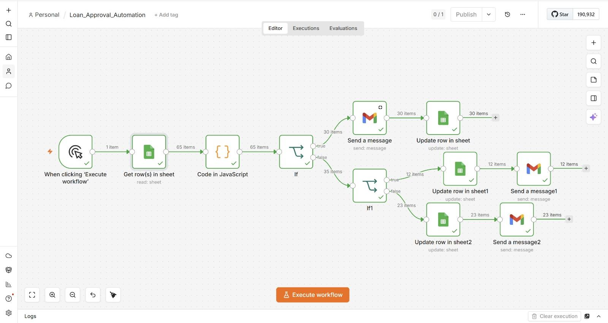
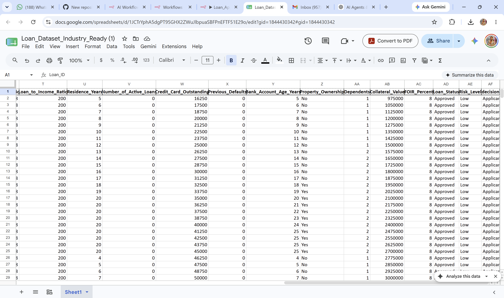
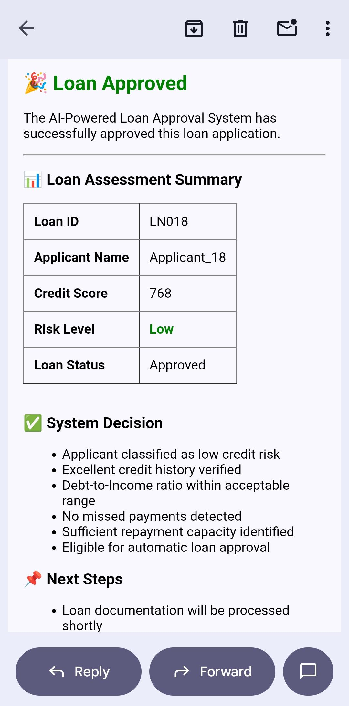
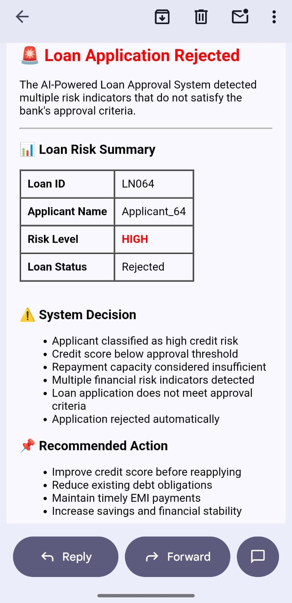
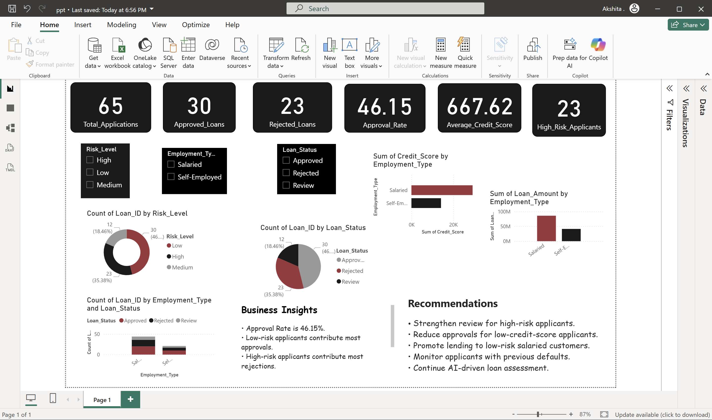

# AI Financial Assistant & Loan Approval Automation

## Project Overview

This repository showcases two AI-powered finance projects:

1. **AI-Powered Loan Approval Automation using n8n**
3. **Power BI Business Intelligence Dashboard**

The projects demonstrate workflow automation, AI-driven decision-making, chatbot development, financial advisory services, data visualization, and business process optimization.

---

# AI-Powered Loan Approval Automation

## Objective

To automate the loan approval process using n8n workflow automation, reducing manual effort and improving decision-making efficiency.

## Technologies Used

- n8n
- Google Sheets
- Gmail
- JavaScript
- Workflow Automation
- AI-Based Risk Assessment

## Workflow Process

1. Loan application data is stored in Google Sheets.
2. n8n reads applicant information.
3. Risk assessment rules are applied.
4. Applicants are categorized into:
   - Low Risk
   - Medium Risk
   - High Risk
5. Loan decision is generated automatically.
6. Status is updated in Google Sheets.
7. Automated email notifications are sent to applicants.

---

## Risk Categories

### Low Risk
- High credit score
- Stable income
- Low debt burden

### Medium Risk
- Average credit score
- Moderate debt ratio

### High Risk
- Low credit score
- High debt obligations

---

## Workflow Architecture

---

## Google Sheets Integration

---

## Email Notification Screenshots

### Low Risk Alert

### Medium Risk Alert

### High Risk Alert

---

# Power BI Dashboard

## Objective

To visualize loan approval data and generate actionable business insights.

---

## Dashboard KPIs

- Total Applications
- Approved Loans
- Rejected Loans
- Approval Rate
- Average Credit Score
- High Risk Applicants

---

## Dashboard Features

### Risk Analysis
- Low Risk Applicants
- Medium Risk Applicants
- High Risk Applicants

### Loan Status Analysis
- Approved
- Rejected
- Review

### Employment Analysis
- Salaried Applicants
- Self-Employed Applicants

### Business Insights
- Approval trends
- Risk distribution
- Loan performance metrics

### Recommendations
- Improve high-risk applicant screening
- Promote low-risk lending
- Monitor credit behavior

---

## Power BI Dashboard Screenshot

---

# Repository Contents

| File | Description |
|--------|-------------|
| Loan_Approval_Automation.json | n8n workflow export |
| Loan_Dataset_Industry_Ready.xlsx | Loan dataset |
| n8n_workflow.png | Workflow architecture |
| google_sheet.png | Google Sheets integration |
| low_risk.jpeg | Low risk email |
| medium_risk_alert.jpeg | Medium risk email |
| high_risk_alert.jpeg | High risk email |
| dashboard.png | Power BI dashboard |

---

# Key Skills Demonstrated

- Workflow Automation
- Power BI Dashboarding
- Financial Analysis
- Business Intelligence
- Google Sheets Automation
- Email Automation
- Risk Assessment
- Data Visualization

---

# Business Impact

- Reduced manual loan processing effort
- Faster approval decisions
- Improved customer communication
- Enhanced financial guidance accessibility
- Better data-driven decision making
- Real-time reporting and monitoring

---

# Author

**Yogesh**

MBA Finance

AI, Automation, Analytics & Business Intelligence Projects

---
